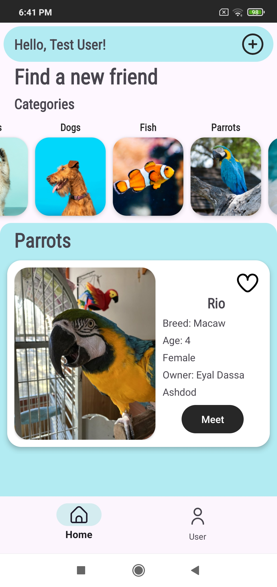
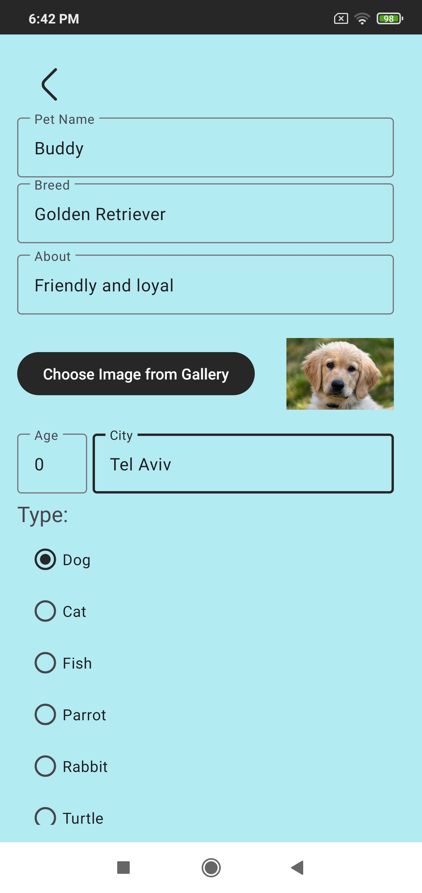

# Adopet


## Overview

This project is part of an Android development course focused on building comprehensive, real-world mobile applications.

**Adopet** is designed to facilitate the process of pet adoption. Users can browse available pets, mark their favorites, and contact pet owners directly through the app. The app also allows users to manage their profiles and view and manage their favorite pets.

### Key Objectives of the Project:

- **Hands-on Experience**: Gain practical experience in Android development, from design to implementation.
- **UI/UX Design**: Implement a user-friendly interface using Material Design principles, ensuring a seamless user experience.
- **Database Integration**: Use Firebase Realtime Database for storing and retrieving pet listings, user profiles, and favorites.
- **State Management**: Manage state effectively across different activities and fragments, ensuring a consistent and reliable user experience.
- **Real-world Application**: Simulate a real-world scenario where users interact with a mobile application to perform useful tasks, such as finding pets for adoption.

### Technologies and Tools Used:

- **Java**: The primary programming language used for developing the application.
- **Android Studio**: The integrated development environment (IDE) used for coding, debugging, and testing.
- **Firebase**: Used for backend services, including Realtime Database, user authentication and storage.
- **Material Design Components**: Implemented for a modern and intuitive user interface.
- **Glide**: Used for efficient image loading and caching within the app.

### Learning Outcomes:

- **Understanding Android Lifecycle**: Comprehensive understanding of Android activity and fragment lifecycles and how to manage them.
- **UI/UX Best Practices**: Applying Material Design guidelines to create a polished and user-friendly interface.
- **Database Management**: Learning how to integrate and interact with cloud-based databases like Firebase.
- **Error Handling and Debugging**: Developing skills to troubleshoot and resolve issues that arise during the development process.


## Features

- **Browse Pets**: View a list of available pets with detailed information.
- **Add Pets for Adoption**: Add pets for adoption, including details such as name, picture, type, breed, and more.
- **Favorite Pets**: Mark pets as favorites for easy access later.
- **Contact Owners**: Send a message or call pet owners directly from the app.
- **Filter Search**: Use category filters to find the perfect pet for you.
- **User Profiles**: Manage your profile, view your favorite pets, add a profile picture, and manage the pets you’ve added.
- **Firebase AuthUI**: Sign in using a phone number, sign out, and delete your account.


## Screenshots

### Sign In


### Firebase AuthUI


### User Details Input


### Home Screen


### Home Screen Filtered


### Pet Details


### Pet Image Expanded


### Add Pet


### Add Pet


### User


### Manage Pets


### Edit Pet


## Installation

### Prerequisites

- Android Studio installed on your machine.
- An Android device or emulator for testing.
- (Optional) Firebase account if you need to set up a backend for testing.

### Setup

1. **Clone the repository:**
   ```bash
   git clone https://github.com/yourusername/yourprojectname.git
